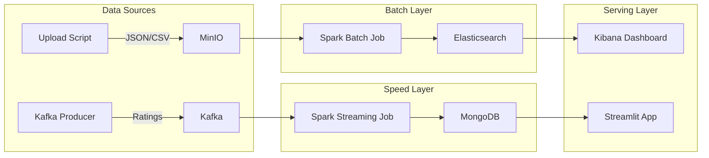

# 🎬 Movie Big Data Analytics Platform

Hệ thống thu thập, lưu trữ, và phân tích dữ liệu phim thời gian thực (Real-time Movie Analytics Platform).
Dự án được xây dựng dựa trên kiến trúc **Lambda Architecture** sử dụng các công nghệ Big Data hiện đại.

## 🏗 Kiến trúc Hệ thống



## 🚀 Cài đặt & Triển khai

### Yêu cầu
- Kubernetes (Minikube / Docker Desktop)
- Python 3.8+
- Helm
- `kubectl`

### Bước 1: Khởi tạo Hạ tầng Plugin
```bash
# Tạo namespace
kubectl apply -f kubernetes/namespace.yaml

# Deploy các dịch vụ (MinIO, Kafka, MongoDB, ELK)
kubectl apply -f kubernetes/minio.yaml
kubectl apply -f kubernetes/kafka.yaml
kubectl apply -f kubernetes/mongodb.yaml
kubectl apply -f kubernetes/elk.yaml
```

### Bước 2: Setup Dữ liệu Batch
```bash
# Cài đặt thư viện
pip install -r requirements.txt

# Upload dữ liệu phim mẫu vào MinIO
python producers/upload_to_minio.py

# Submit Spark Batch Job (Giả định môi trường đã có spark-submit hoặc dùng Spark Operator)
# spark-submit spark_jobs/batch/batch_etl.py
```

### Bước 3: Setup Dữ liệu Streaming
```bash
# Chạy Kafka Producer (giả lập rating)
python producers/kafka_producer.py
```

```bash
# Chạy Spark Streaming Job (Terminal khác)
# spark-submit --packages org.apache.spark:spark-sql-kafka-0-10_2.12:3.1.2,org.mongodb.spark:mongo-spark-connector_2.12:3.0.1 spark_jobs/stream/stream_processing.py
```

### Bước 4: Xem Dashboard
```bash
# Chạy ứng dụng Streamlit
streamlit run dashboard/app.py
```

## 📂 Cấu trúc Thư mục
- `kubernetes/`: Các file deployment K8s.
- `producers/`: Script sinh dữ liệu giả lập.
- `spark_jobs/`: Source code xử lý dữ liệu Spark (Batch & Streaming).
- `dashboard/`: Mã nguồn ứng dụng hiển thị Streamlit.

## 📝 Liên hệ
[Tên của bạn] - Big Data Project
