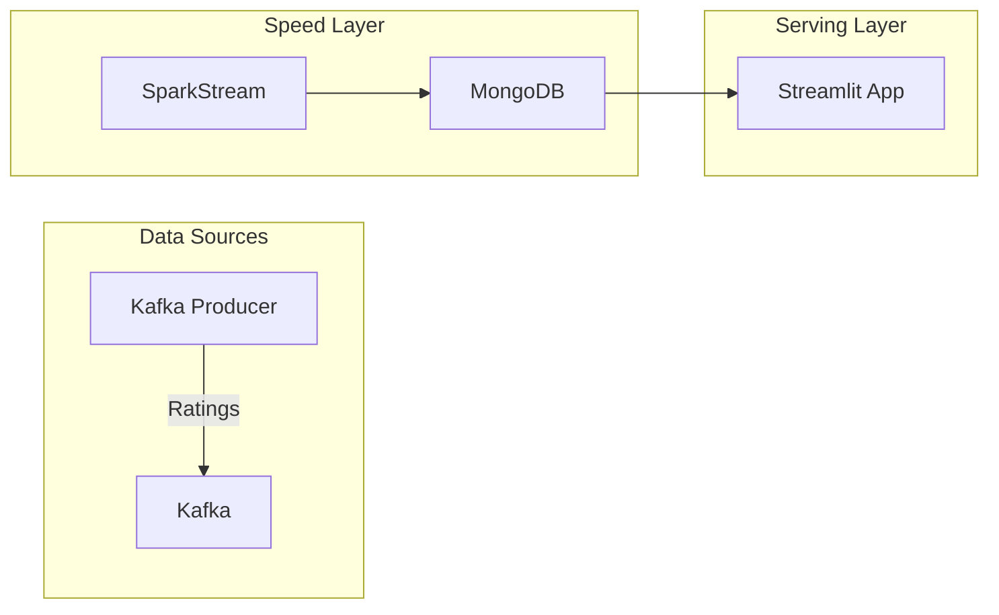

# 🎬 Movie Big Data Analytics Platform

Hệ thống thu thập, lưu trữ, và phân tích dữ liệu phim thời gian thực (Real-time Movie Analytics Platform).
Dự án được xây dựng dựa trên kiến trúc **Lambda Architecture** sử dụng các công nghệ Big Data hiện đại.

## 🏗 Kiến trúc Hệ thống



## 🚀 Cài đặt & Triển khai

### Yêu cầu
- Kubernetes (Minikube / Docker Desktop)
- Python 3.8+
- Helm
- `kubectl`

### Bước 1: Khởi tạo Hạ tầng Plugin
```bash
# Tạo namespace
kubectl apply -f kubernetes/namespace.yaml

# Deploy các dịch vụ (Kafka, MongoDB)
kubectl apply -f kubernetes/kafka.yaml
kubectl apply -f kubernetes/mongodb.yaml
```

### Bước 2: Setup Thư viện cần thiết
```bash
# Cài đặt thư viện
pip install -r requirements.txt

```

### Bước 3: Setup Dữ liệu Streaming
```bash
# Chạy Kafka Producer 
python producers/real_movie_producer.py
```

```bash
# Chạy bridge consumer
python dashboard/kafka_to_mongo_bridge.py
```

### Bước 4: Xem Dashboard
```bash
# Chạy ứng dụng Streamlit
streamlit run dashboard/app.py
```

## 📂 Cấu trúc Thư mục
- `kubernetes/`: Các file deployment K8s.
- `producers/`: Script sinh dữ liệu giả lập.
- `dashboard/`: Mã nguồn ứng dụng bridge kaffka hứng data và hiển thị Streamlit.

## 📝 Liên hệ
[Nguyễn Tiểu Anh] - Big Data Project
